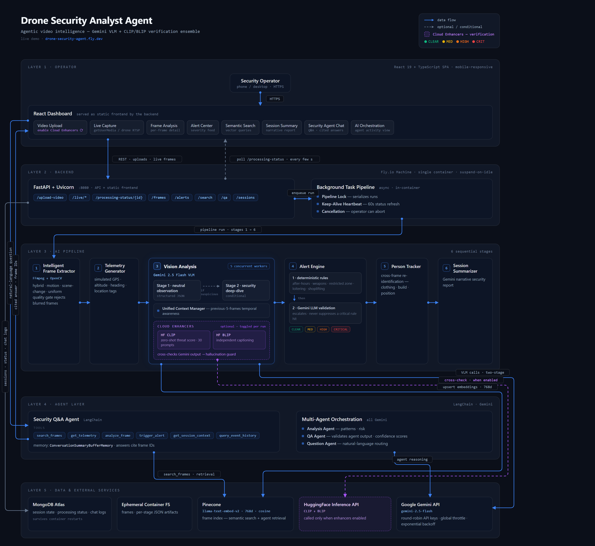
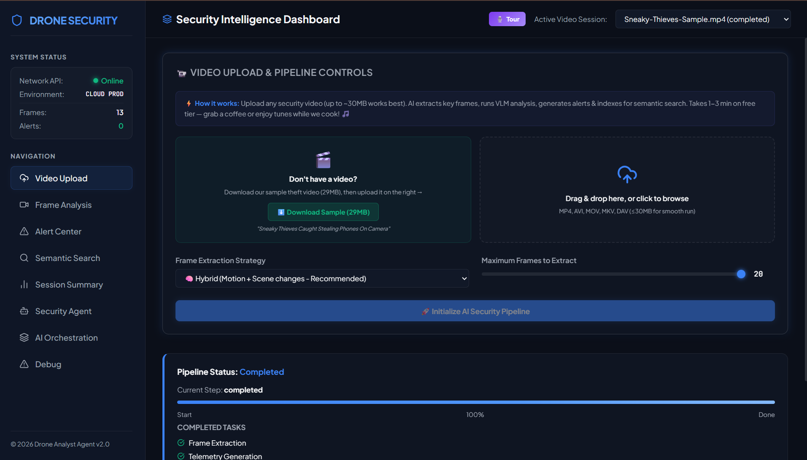
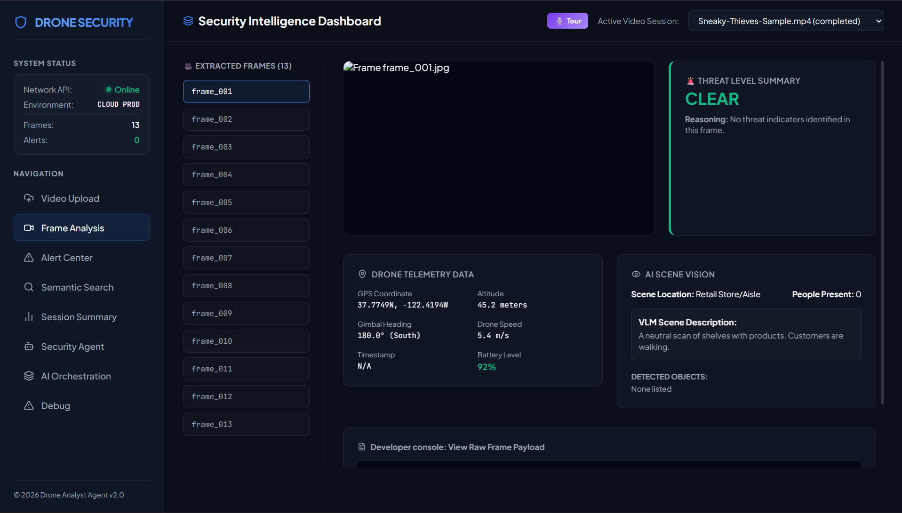
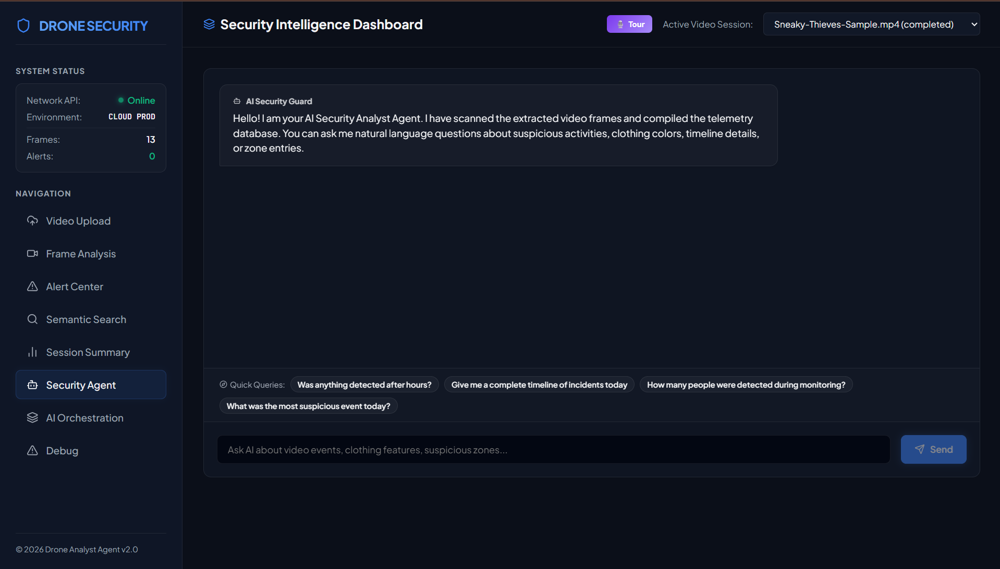

# Drone Security Analyst Agent

**AI-Powered Autonomous Security Surveillance System**

[](https://python.org)
[](https://fastapi.tiangolo.com)
[](https://react.dev)
[](https://cloud.google.com/run)
[](https://ai.google.dev)

> An end-to-end AI agent that ingests drone surveillance video, extracts frames using intelligent strategies, analyzes each frame with multi-model vision AI, detects security threats, generates alerts, and provides a natural-language Q&A interface — all exposed through a production REST API and React dashboard.

**Live Demo:** [https://drone-security-agent.fly.dev/](https://drone-security-agent.fly.dev/)

---

## Table of Contents

- [Overview](#overview)
- [Architecture](#architecture)
- [Key Features](#key-features)
- [Tech Stack](#tech-stack)
- [Project Structure](#project-structure)
- [Getting Started](#getting-started)
- [Configuration](#configuration)
- [API Reference](#api-reference)
- [Processing Pipeline](#processing-pipeline)
- [AI Models & Analysis](#ai-models--analysis)
- [Alert System](#alert-system)
- [Deployment](#deployment)
- [Development](#development)

---

## Overview

The Drone Security Analyst Agent automates physical security monitoring by processing drone surveillance footage through a multi-stage AI pipeline:

1. **Intelligent Frame Extraction** — hybrid strategy combining uniform sampling, motion detection, and scene-change detection to capture the most informative frames from any video.
2. **Multi-Model Vision Analysis** — Gemini 2.5 Pro/Flash for deep scene understanding, with optional CLIP + BLIP cloud analyzers for supplementary pattern recognition.
3. **Threat Classification** — a deterministic rule engine that escalates threat levels (CLEAR → LOW → MEDIUM → HIGH → CRITICAL) based on detected behaviors, time-of-day, and zone context.
4. **Vector Search & Q&A** — frames are indexed in Pinecone with integrated inference embeddings, enabling natural-language semantic search and a conversational security agent.
5. **Persistent Sessions** — each video upload creates an isolated session with MongoDB-backed status tracking that survives container restarts.

---

## Architecture

<p align="center">
  
</p>

---

## UI Screenshots

### Homepage / Landing Page

<p align="center">
  
</p>

### Frame Analysis View

<p align="center">
  
</p>

### AI Security Agent (Q&A)

<p align="center">
  
</p>

---

## Key Features

| Feature | Description |
|---------|-------------|
| **14+ Video Formats** | MP4, AVI, MOV, DAV, MKV, WMV, FLV, WebM, MPEG, 3GP, TS, M4V, M2TS |
| **Intelligent Extraction** | Hybrid strategy (motion + scene change + uniform) extracts only meaningful frames |
| **Gemini 2.5 Vision** | Two-stage analysis: neutral observation → security deep-dive |
| **Cloud Enhanced Analyzer** | Optional CLIP + BLIP via Hugging Face Inference API |
| **Person Tracking** | Cross-frame re-identification by clothing, features, and position |
| **Threat Scoring** | 5-level severity with deterministic rule engine + LLM validation |
| **Semantic Search** | Natural language queries over indexed frames via Pinecone |
| **AI Q&A Agent** | Conversational security assistant with session context |
| **MongoDB Persistence** | Session state survives container restarts and autoscaling |
| **React Dashboard** | Modern glassmorphic UI with real-time processing status |
| **Google Cloud Run** | Production deployment with auto-scaling and CI/CD |

---

## Tech Stack

| Layer | Technology |
|-------|-----------|
| **Vision AI** | Google Gemini 2.5 Pro / Flash, CLIP (ViT-L/14), BLIP |
| **Embeddings** | Pinecone integrated inference (llama-text-embed-v2, 768d) |
| **Vector DB** | Pinecone (cosine similarity, metadata filtering) |
| **Backend** | FastAPI, Uvicorn, Python 3.10+ |
| **Frontend** | React 19, TypeScript, Vite 8, Lucide Icons |
| **Database** | MongoDB Atlas (session persistence) |
| **Frame Processing** | OpenCV, FFmpeg, Pillow |
| **Deployment** | Fly.io (recommended) or Google Cloud Run, Docker |
| **Verification Ensemble** | HF CLIP + BLIP cloud enhancers (cross-check Gemini, toggle per run) |

---

## Project Structure

```
drone-security-agent-1/
├── src/                          # Core Python modules
│   ├── api.py                    # FastAPI application & endpoints
│   ├── config.py                 # Pydantic settings & env management
│   ├── session_bootstrap.py      # Session directory layout
│   ├── intelligent_frame_extractor.py  # Hybrid frame extraction
│   ├── frame_extractor.py        # Basic FFmpeg extraction
│   ├── vision_analyzer.py        # Gemini vision analysis
│   ├── cloud_enhanced_analyzer.py # CLIP + BLIP cloud analysis
│   ├── alert_engine.py           # Threat classification & alerts
│   ├── pinecone_indexer.py       # Vector indexing & search
│   ├── qa_agent.py               # Natural language Q&A agent
│   ├── person_tracker.py         # Cross-frame person tracking
│   ├── telemetry_generator.py    # Drone telemetry simulation
│   ├── summarizer.py             # Session summary generation
│   ├── gemini_client.py          # Gemini API client with retries
│   ├── mongodb_storage.py        # MongoDB session storage
│   ├── unified_context.py        # Unified session context
│   ├── context_manager.py        # Rich context store
│   └── ai_orchestration/         # Multi-agent orchestration
├── frontend/                     # React + TypeScript dashboard
│   ├── src/                      # React components
│   ├── package.json              # Dependencies (React 19, Vite 8)
│   └── vite.config.ts            # Vite configuration
├── tests/                        # Test suite
├── data/                         # Runtime data (frames, sessions)
├── outputs/                      # Analysis outputs
├── Dockerfile.light              # Production multi-stage build
├── cloudbuild.yaml               # Google Cloud Build CI/CD
├── requirements.txt              # Full Python dependencies
├── requirements.light.txt        # Lightweight production deps
└── .env.example                  # Environment variable template
```

---

## Getting Started

### Prerequisites

- Python 3.10+
- Node.js 20+ (for frontend)
- FFmpeg installed and on PATH
- API keys: Gemini, Pinecone (minimum required)

### Local Development

```bash
# Clone the repository
git clone https://github.com/rajj28/drone-security-agent.git
cd drone-security-agent

# Set up Python environment
python -m venv venv
venv\Scripts\activate        # Windows
# source venv/bin/activate   # Linux/Mac

# Install dependencies
pip install -r requirements.txt

# Configure environment
cp .env.example .env
# Edit .env with your API keys (at minimum: Vertex AI settings USE_VERTEX_AI/GCP_PROJECT_ID/GCP_LOCATION, and PINECONE_API_KEY)

# Start the API server
uvicorn src.api:app --reload --host 0.0.0.0 --port 8000

# (In another terminal) Start the frontend
cd frontend
npm install
npm run dev
```

The API will be available at `http://localhost:8000` and the dashboard at `http://localhost:5173`.

---

## Configuration

All configuration is managed through environment variables (`.env` file). Key variables:

```bash
# Required — Gemini runs through Vertex AI (postpaid GCP billing)
USE_VERTEX_AI=true
GCP_PROJECT_ID=your_gcp_project
GCP_LOCATION=us-central1
PINECONE_API_KEY=your_pinecone_api_key

# Gemini model selection
GEMINI_MODEL=gemini-2.5-pro
GEMINI_FALLBACK_MODEL=gemini-2.5-flash
GEMINI_PREFER_FLASH=true          # Use Flash first to save quota
API_MIN_INTERVAL_SEC=12            # Rate limit pacing

# Pinecone
PINECONE_INDEX_NAME=flytbase
PINECONE_DIMENSION=768
PINECONE_USE_INTEGRATED=true       # Use llama-text-embed-v2 integrated inference
PINECONE_NAMESPACE=drone-security

# Optional: Cloud Enhancers — CLIP + BLIP cross-check of Gemini analysis
# (toggle per run from the dashboard's "Enable Cloud Enhancers" switch)
HF_API_TOKEN=your_huggingface_token

# Optional: MongoDB persistence
MONGODB_URI=mongodb+srv://...

# Session
SESSION_ID=                         # Leave empty for API-managed sessions
MAX_FRAMES=20
```

See `.env.example` for the full list.

---

## API Reference

### Core Endpoints

| Method | Endpoint | Description |
|--------|----------|-------------|
| `GET` | `/` | API info |
| `GET` | `/health` | System health + MongoDB status |
| `POST` | `/upload-video` | Upload video for processing |
| `GET` | `/processing-status/{session_id}` | Processing progress |
| `GET` | `/sessions` | List all sessions |
| `GET` | `/frames` | List extracted frames |
| `GET` | `/alerts` | Get security alerts |
| `POST` | `/search` | Semantic frame search |
| `POST` | `/qa` | Ask the security agent |
| `GET` | `/session/summary` | Session summary report |

### Upload Video

```bash
curl -X POST "https://drone-security-dashboard-27774218566.us-central1.run.app/upload-video" \
  -F "file=@surveillance.mp4" \
  -F "extraction_strategy=hybrid" \
  -F "max_frames=100"
```

**Parameters:**
- `file` — Video file (any of the 14 supported formats)
- `session_id` — Optional; auto-generated UUID if omitted
- `extraction_strategy` — `uniform`, `motion_based`, `scene_change`, or `hybrid` (default)
- `max_frames` — 10–500 (default: 100)

### Semantic Search

```bash
curl -X POST "http://localhost:8000/search" \
  -H "Content-Type: application/json" \
  -d '{"query": "person reaching towards shelf", "top_k": 5}'
```

### Q&A Agent

```bash
curl -X POST "http://localhost:8000/qa" \
  -H "Content-Type: application/json" \
  -d '{"question": "Were there any suspicious activities near the entrance?"}'
```

---

## Processing Pipeline

When a video is uploaded, the system executes a 6-step background pipeline:

```
1. Frame Extraction (20%)     → Intelligent hybrid extraction (FFmpeg + OpenCV)
2. Telemetry Generation (40%) → Simulated drone GPS, altitude, heading
3. Vision Analysis (60%)      → Gemini 2.5 per-frame analysis
4. Alert Generation (80%)     → Rule engine + LLM threat validation
5. Person Tracking (90%)      → Cross-frame re-identification
6. Session Summary (100%)     → Aggregated security report
```

Each step updates the session status in MongoDB, enabling real-time progress tracking from the frontend.

---

## AI Models & Analysis

### Two-Stage Vision Analysis

**Stage 1 — Neutral Observation:**
The vision model describes the scene objectively (people, objects, actions, environment).

**Stage 2 — Security Deep-Dive:**
If suspicious keywords are detected (reaching, concealing, loitering, etc.), a focused security analysis extracts:
- Threat level and type
- Person descriptions and positions
- Recommended actions

### Cloud Enhanced Analyzer (Optional)

When `USE_CLOUD_ANALYZER=true`, supplementary analysis runs via:
- **CLIP (ViT-L/14):** Pattern matching against 20+ security behavior categories
- **BLIP:** Natural language scene captioning with keyword extraction

These results are fused with Gemini's analysis for higher confidence scoring.

---

## Alert System

### Severity Levels

| Level | Trigger | Action |
|-------|---------|--------|
| **CLEAR** | Normal activity | Log only |
| **LOW** | Minor anomaly | Monitor |
| **MEDIUM** | Suspicious behavior detected | Investigate |
| **HIGH** | After-hours intrusion, loitering, threat | Immediate response |
| **CRITICAL** | Weapons, fire, active threat | Emergency dispatch |

### Escalation Rules

1. Unknown signals → escalate to MEDIUM
2. After-hours activity → escalate to HIGH
3. Weapons / fire detection → escalate to CRITICAL
4. Vehicle in restricted zone → escalate to MEDIUM
5. Loitering detection → escalate to HIGH

---

## Deployment

The project deploys as a single container serving both the FastAPI backend and the React frontend (static files served from `/frontend/dist/`).

### Fly.io (Recommended)

Fly.io machines give the background video pipeline full CPU (Cloud Run throttles CPU once the HTTP response is sent) and suspend/resume in ~1s instead of cold-starting. Config lives in `fly.toml`.

```bash
# One-time setup
fly apps create drone-security-agent
fly secrets set USE_VERTEX_AI=true GCP_PROJECT_ID="..." GCP_LOCATION="us-central1" GCP_ADC_JSON="$(base64 -w0 gcp-credentials.json)" PINECONE_API_KEY="..." MONGODB_URI="..."

# Build frontend + deploy
cd frontend && npm run build && cd ..
fly deploy
```

See [FLY_DEPLOYMENT.md](FLY_DEPLOYMENT.md) for the full guide (secrets, scaling, troubleshooting).

### Google Cloud Run (Alternative)

```bash
# Build the production image
docker build -f Dockerfile.light -t gcr.io/YOUR_PROJECT/drone-security-api:latest .

# Push to Container Registry
docker push gcr.io/YOUR_PROJECT/drone-security-api:latest

# Deploy to Cloud Run
gcloud run deploy drone-security-dashboard \
  --image gcr.io/YOUR_PROJECT/drone-security-api:latest \
  --region us-central1 \
  --platform managed \
  --allow-unauthenticated \
  --memory 2Gi \
  --cpu 2 \
  --set-env-vars "USE_VERTEX_AI=true,GCP_PROJECT_ID=...,GCP_LOCATION=us-central1,PINECONE_API_KEY=...,MONGODB_URI=..."
```

### Docker Compose (Local)

```bash
docker-compose up -d
```

---

## Development

### Running Tests

```bash
pytest tests/ -v
```

### Project Evaluation

```bash
python evaluate_project.py
```

### Adding New Analysis Models

1. Create a new analyzer in `src/` implementing the analysis interface
2. Register it in the pipeline in `src/api.py` → `process_video_pipeline()`
3. Update the alert engine rules if needed

---

## Live Deployment

- **Dashboard + API:** https://drone-security-dashboard-27774218566.us-central1.run.app/
- **Health Check:** https://drone-security-dashboard-27774218566.us-central1.run.app/health
- **API Docs:** https://drone-security-dashboard-27774218566.us-central1.run.app/docs

---

## License

MIT License — see [LICENSE](LICENSE) for details.

---

Built for the FlytBase AI Engineer Assignment — demonstrating autonomous AI-powered drone security surveillance with production-grade architecture, multi-model vision analysis, and real-time threat detection.
