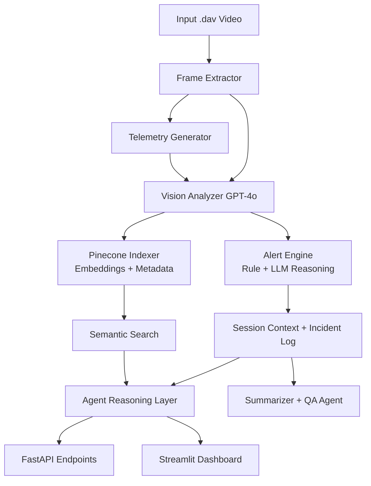

# Drone Security Analyst Architecture

## 1) Pipeline Overview

This prototype uses a staged pipeline so every frame can be traced from raw video to alert and retrieval.

## 2) Pipeline Narrative

1. Frame extraction reads the DVR video and writes frame images to `data/extracted`.
2. Telemetry generation creates per-frame operational context such as location, timestamp, restricted-zone flag, and after-hours flag.
3. Vision analysis calls GPT-4o vision and emits a structured JSON record per frame with objects, people, vehicles, activity, and threat signals.
4. Alert engine applies deterministic rules first, then uses an LLM reasoning layer for validation/override context.
5. Pinecone indexing stores frame descriptions and metadata for cross-domain retrieval (time/object/semantic query).
6. Stateful agent consumes analysis + telemetry + alerts + retrieval context to produce recommendations.
7. FastAPI and Streamlit expose results for operators, while summarizer and QA produce shift-level intelligence outputs.

## 3) Data Contracts

### 3.1 Telemetry Contract (`outputs/telemetry/frame_XXX_telemetry.json`)

- `frame_id: str`
- `timestamp: str` (HH:MM:SS)
- `location: str`
- `drone: dict` (position/altitude/battery fields)
- `is_after_hours: bool`
- `is_restricted_zone: bool`

### 3.2 Vision Analysis Contract (`outputs/analysis/frame_XXX_analysis.json`)

- `frame_id: str`
- `timestamp: str`
- `location: str`
- `vlm_description: str`
- `scene_type: str`
- `objects_detected: list[str]`
- `object_details: list[dict]`
- `people_count: int`
- `person_features: list[dict]`
- `vehicles_detected: list[str]`
- `vehicle_details: list[dict]`
- `activity: str`
- `security_signals: list[str]`
- `suspicious_elements: list[str]`
- `threat_assessment: str` (`none|low|medium|high`)
- `confidence: float` (`0..1`)
- `recommended_action: str`
- `alert_reasoning: str`
- `alert_priority_signals: list[str]`

### 3.3 Alert Contract (`outputs/alerts/frame_XXX_alert.json`)

- `alert_id: str`
- `frame_id: str`
- `timestamp: str`
- `location: str`
- `alert_triggered: bool`
- `severity: str` (`NONE|LOW|MEDIUM|HIGH`)
- `alert_type: str | null`
- `message: str`
- `objects_involved: list[str]`
- `rule_triggered: str | null`
- `llm_validated: bool`
- `llm_reasoning: str`
- `recommended_action: str`
- `acknowledged: bool`
- `auto_escalate: bool`

### 3.4 Session Context Contract (`outputs/session/session_context.json`)

- `frames_analyzed: int`
- `total_alerts: int`
- `high_alerts: int`
- `medium_alerts: int`
- `low_alerts: int`
- `people_detected: int`
- `vehicles_detected: int`
- `locations_visited: list[str]`
- `incidents: list[dict]`
- `agent_processed_frames: list[str]`
- `alert_processed_frames: list[str]`
- `running_narrative: str`

## 4) Alert Flow

1. Vision analysis produces frame-level threat metadata.
2. Rule engine applies deterministic security policies:
	- Person after hours => HIGH
	- Person in restricted zone => HIGH
	- Crowd/loitering => MEDIUM
	- High threat assessment => HIGH
3. LLM alert reasoning layer validates or adjusts severity for ambiguous cases.
4. Alert payload is persisted and rolled into session context and context summaries.
5. High alerts can be flagged for escalation (`auto_escalate=true`).

## 5) Memory Flow

The system uses two memory tracks to avoid coupling and duplicate inflation.

1. Agent memory
	- Runtime summary memory: `ConversationSummaryBufferMemory`
	- Persistent log: `outputs/session/agent_memory_log.json`
	- Idempotency guard: `agent_processed_frames`

2. Alert memory
	- Runtime summary memory: `ConversationSummaryBufferMemory`
	- Persistent log: `outputs/session/alert_memory_log.json`
	- Idempotency guard: `alert_processed_frames`

3. Shared context timeline
	- `outputs/session/context_summaries.json` stores per-frame cumulative summaries used in later reasoning prompts.

## 6) Scalability Notes

- Frame-level artifacts are append-only JSON, enabling replay and auditing.
- Pinecone vector index enables semantic retrieval at larger history sizes.
- Reasoning layers consume only a rolling context window to bound token usage.
- Duplicate frame guards prevent accidental double counting during reruns.
